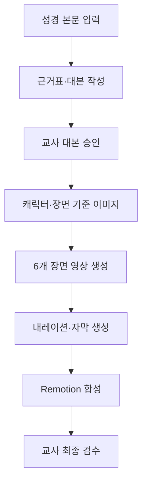

# 성경 말씀 AI 애니메이션 PoC 제작 매뉴얼

> 최종 확인일: 2026-08-02  
> 대상: 교회 초등부 3~4학년  
> 입력: 당일 성경 본문 1개  
> 출력: 성경 내용을 중심으로 한 60~90초 MP4 애니메이션

## 1. 결론: 첫 PoC는 이렇게 만든다

첫 PoC에서는 웹 서비스와 완전 자동화 시스템을 먼저 만들지 않는다. 다음 한 편을 직접 완성해 AI 영상 품질과 제작 절차를 검증한다.



첫 편의 제작 비중은 다음과 같이 잡는다.

- 수동 기획·선택·검수: 약 70%
- TypeScript·Remotion 합성: 약 30%
- NestJS, Next.js, PostgreSQL, n8n, Temporal: 첫 PoC에서는 제외

PoC에서 먼저 증명할 것은 자동화가 아니라 다음 세 가지다.

1. 성경 본문이 왜곡되지 않는가
2. 같은 인물이 장면마다 비슷하게 유지되는가
3. 초등부 3~4학년이 재미있고 쉽게 볼 수 있는가

---

## 2. 완료 기준

| 항목 | PoC 목표 |
| --- | --- |
| 본문 | 사용 권한을 확인한 번역본의 본문 1개 |
| 영상 길이 | 60~90초 |
| 화면 | 16:9, 1920×1080, 30fps |
| 장면 | 제목·마무리를 제외한 핵심 장면 6개 |
| 장면 길이 | 장면당 약 6~10초 |
| 인물 | 핵심 인물 1~2명, 한 화면 최대 3명 권장 |
| 음성 | 첫 PoC는 내레이터 1명 중심 |
| 대사 | 직접 인용이 꼭 필요한 경우에만 짧게 사용 |
| 자막 | 한국어 내레이션과 동일한 내용 |
| 성경 근거 | 모든 내레이션과 장면에 `sourceVerses` 기록 |
| 최종 파일 | H.264 영상 + AAC 음성의 MP4 |
| 승인 | 담당 교사가 대본과 최종 영상을 승인 |

다음 조건을 모두 만족하면 PoC를 성공으로 판정한다.

- 사건 순서, 인물, 행동, 핵심 메시지에 중대한 왜곡이 없다.
- 본문에 없는 창작 대사를 실제 성경 내용처럼 넣지 않았다.
- 핵심 인물의 얼굴·의상·나이대가 6개 장면 중 5개 이상에서 일관된다.
- 심한 신체 왜곡, 현대 물건, 생성된 잘못된 문자가 없다.
- 폭력과 공포가 초등부 3~4학년에게 자극적으로 표현되지 않는다.
- 음성, 자막, 장면 순서가 일치한다.
- 담당 교사가 수업 시간에 보여줄 수 있는 결과라고 승인한다.

---

## 3. 첫 PoC 권장 구성

### 3.1 본문 선택 기준

첫 본문은 다음 조건에 가까울수록 좋다.

- 핵심 사건이 하나다.
- 중심인물이 1~2명이다.
- 장소가 1~2곳이다.
- 시간 순서가 분명하다.
- 전쟁, 군중, 복잡한 기적 표현이 적다.
- 60~90초 안에 시작·사건·결론을 설명할 수 있다.

첫 검증용 본문으로는 `마가복음 4장 35~41절, 예수님이 풍랑을 잠잠하게 하신 사건`처럼 사건과 장소가 분명한 본문이 적합하다. 실제 제작 본문은 당일 말씀으로 교체하면 된다.

### 3.2 권장 영상 구성

| 구간 | 시간 | 내용 |
| --- | ---: | --- |
| 제목 | 4초 | 본문 제목과 성경 위치 |
| 장면 1 | 8초 | 사건의 시작과 장소 |
| 장면 2 | 8초 | 문제 발생 |
| 장면 3 | 8초 | 인물의 반응 |
| 장면 4 | 8초 | 핵심 행동 또는 말씀 |
| 장면 5 | 8초 | 사건의 변화 |
| 장면 6 | 8초 | 결과와 인물의 반응 |
| 마무리 | 8~12초 | 핵심 메시지, 본문 범위 |

전체 길이는 약 60~64초다. 내레이션 길이에 따라 각 장면을 1~3초 늘릴 수 있다.

첫 PoC에서는 입 모양 동기화와 여러 인물의 대화를 제외한다. 승인된 내레이션을 장면 위에 합성하면 성경 정확성과 영상 품질에 집중할 수 있다.

---

## 4. 사용할 도구

| 단계 | 기본 도구 | 용도 |
| --- | --- | --- |
| 본문 분석·대본 | 구조화 출력이 가능한 고성능 LLM | 사건·인물·근거 절 추출, 어린이용 대본 |
| 캐릭터·장면 이미지 | Gemini 3.1 Flash Image | 캐릭터 기준 이미지와 16:9 시작 프레임 |
| 장면 영상 | Gemini Omni Flash | 참조 이미지 기반의 짧은 장면 영상 |
| 특수 영상 기능 | Veo 3.1 | 마지막 프레임 제어, 장면 연장 등이 필요할 때 |
| 대체 영상 | Runway Gen-4.5 | Google 결과가 기준 미달일 때 비교 후보 생성 |
| 내레이션 | ElevenLabs TTS with timestamps | 한국어 음성과 자막 동기화용 타이밍 |
| 합성 | Remotion | 장면·음성·자막·제목을 TypeScript로 합성 |
| 검사·후처리 | FFmpeg·ffprobe | 파일 규격 검사와 음량 정규화 |

모델 이름은 공급자 업데이트로 변경될 수 있다. 코드에 모델명을 여러 곳에 직접 쓰지 말고 환경 변수나 설정 파일 한 곳에서 관리한다.

PoC 기본 선택은 `Gemini Omni Flash`다. `Veo 3.1`은 마지막 프레임 제어 또는 영상 연장이 필요한 장면에 사용하고, `Runway Gen-4.5`는 결과 비교와 대체 생성에 사용한다.

---

## 5. 사전 준비

### 5.1 계정과 API 키

다음을 준비한다.

- Google AI Studio 또는 Gemini API를 사용할 수 있는 Google 계정
- ElevenLabs 계정과 한국어 음성의 Voice ID
- 선택 사항: Runway 개발자 계정
- Node.js 20 이상 버전. LTS 사용 권장
- FFmpeg와 ffprobe

설치 확인:

```bash
node --version
npm --version
ffmpeg -version
ffprobe -version
```

### 5.2 환경 변수

로컬 `.env.local`에 다음 값을 저장한다.

```dotenv
GEMINI_API_KEY=실제_API_키
ELEVENLABS_API_KEY=실제_API_키
ELEVENLABS_VOICE_ID=선택한_한국어_VOICE_ID
RUNWAYML_API_SECRET=선택_사항

GOOGLE_IMAGE_MODEL=gemini-3.1-flash-image
GOOGLE_VIDEO_MODEL=gemini-omni-flash-preview
RUNWAY_VIDEO_MODEL=gen4.5
```

주의 사항:

- `.env.local`은 Git에 커밋하지 않는다.
- API 키를 프런트엔드 코드에 넣지 않는다.
- 모델명이 공식 문서와 다르면 공식 문서의 현재 이름으로 환경 변수만 수정한다.
- 생성 결과 URL은 만료될 수 있으므로 작업 완료 후 즉시 로컬 또는 저장소에 다운로드한다.
- 현재 `gemini-omni-flash-preview`의 생성 결과는 3~10초, 720p, 24fps다. 최종 1080p·30fps 렌더링은 출력 규격을 통일하는 것이며 원본에 없던 세부 품질을 새로 만드는 것은 아니다.

### 5.3 작업 폴더

```text
work/poc-001/
├── input/
│   ├── passage.md
│   └── project.yaml
├── plan/
│   ├── evidence-map.json
│   ├── script.json
│   ├── style-bible.json
│   └── character-bible.json
├── references/
│   ├── characters/
│   └── locations/
├── scenes/
│   ├── scene-01/
│   ├── scene-02/
│   └── ...
├── audio/
├── subtitles/
├── qa/
└── output/
```

`work/` 아래의 생성 이미지·영상·음성은 Git에 넣지 않는다. Git에는 입력 예제, 스키마, 프롬프트, 코드만 저장한다.

---

## 6. 단계별 제작 절차

### 1단계: 본문 입력 파일 작성

`work/poc-001/input/project.yaml`을 작성한다.

```yaml
project_id: poc-001
title: 예수님이 풍랑을 잠잠하게 하셨어요
passage:
  book: 마가복음
  chapter_start: 4
  verse_start: 35
  chapter_end: 4
  verse_end: 41
translation: 사용 권한을 확인한 번역본
scripture_text_file: ./passage.md
audience: 초등부 3~4학년
duration_seconds: 64
scene_count: 6
aspect_ratio: "16:9"
resolution: "1920x1080"
fps: 30
visual_style: warm_storybook_animation
creative_dialogue_allowed: false
```

`passage.md`에는 교회에서 사용 권한을 확인한 번역본의 본문을 넣는다. 서로 다른 번역본을 출처 표시 없이 섞지 않는다.

### 2단계: 본문 근거표 만들기

LLM에 본문과 다음 프롬프트를 전달한다.

```text
역할: 성경 본문 구조 분석자

대상은 교회 초등부 3~4학년이다.
입력된 본문 밖의 지식으로 사건이나 대사를 추가하지 마라.

다음을 JSON으로 반환하라.
1. 등장인물
2. 장소
3. 시간 순서대로 정리한 사건
4. 핵심 메시지
5. 각 사건의 근거 절
6. 직접 인용 가능한 문장과 근거 절
7. 본문만으로 확정할 수 없는 내용

모든 항목에는 sourceVerses를 넣어라.
본문만으로 확인되지 않는 내용은 inferred 또는 unknown으로 표시하라.
```

결과를 `plan/evidence-map.json`에 저장한다. 이 파일은 이후 모든 대본과 장면을 검증하는 기준이다.

### 3단계: 6개 장면 대본 만들기

다음 프롬프트로 장면 대본을 생성한다.

```text
역할: 초등부 3~4학년용 성경 애니메이션 대본 작가

입력:
- 성경 본문
- evidence-map.json
- 목표 길이 60~90초
- 핵심 장면 6개

규칙:
- 사건 순서와 핵심 의미를 바꾸지 마라.
- 본문에 없는 창작 대사는 작성하지 마라.
- 한 장면에는 한 가지 핵심 행동만 넣어라.
- 내레이션은 짧고 쉬운 한국어로 작성하라.
- 직접 인용, 본문 요약, 내레이터 설명을 구분하라.
- 모든 내레이션과 시각 요소에 sourceVerses를 넣어라.
- 폭력과 공포는 비자극적으로 표현하라.
- 화면에 글자를 생성하도록 지시하지 마라.

각 장면을 다음 필드로 반환하라.
sceneId, title, durationSeconds, sourceVerses, claimType,
narration, characters, location, visualAction, camera,
safetyNotes, forbiddenElements
```

장면 데이터 예시:

```json
{
  "sceneId": "scene-03",
  "title": "제자들이 두려워하다",
  "durationSeconds": 8,
  "sourceVerses": ["마가복음 4:37-38"],
  "claimType": "paraphrase",
  "narration": "제자들은 거센 바람과 큰 물결을 보고 무서워했어요.",
  "characters": ["jesus", "disciples"],
  "location": "boat_on_lake",
  "visualAction": "제자들이 흔들리는 배 안에서 서로 붙잡는다.",
  "camera": "배 안쪽에서 천천히 제자들에게 가까워진다.",
  "safetyNotes": "공포 표정을 과장하지 않는다.",
  "forbiddenElements": ["현대식 배", "부상", "피", "화면 문자"]
}
```

`claimType`은 다음 값만 사용한다.

- `direct_quote`: 입력 본문의 직접 인용
- `paraphrase`: 본문을 어린이 눈높이로 요약
- `narrator_explanation`: 이해를 돕는 설명
- `creative`: 본문에 없는 창작 표현. 첫 PoC에서는 금지

### 4단계: 대본 검수와 승인

영상 생성 전에 담당 교사가 다음을 확인한다.

- 6개 장면의 순서가 본문과 같은가
- 각 내레이션에 적절한 `sourceVerses`가 있는가
- 본문에 없는 대사·감정·행동이 사실처럼 추가되지 않았는가
- 핵심 메시지가 누락되거나 다른 교훈으로 바뀌지 않았는가
- 초등부 3~4학년이 이해할 수 있는 문장인가

대본이 승인되기 전에는 이미지와 영상을 생성하지 않는다. 대본이 바뀌면 이미지와 영상을 다시 만들어야 하므로 이 단계가 가장 중요한 승인 지점이다.

### 5단계: 화풍과 캐릭터 기준 만들기

`style-bible.json`에 공통 화풍을 고정한다.

```json
{
  "styleId": "warm-storybook-v1",
  "basePrompt": "따뜻한 아동용 스토리북 애니메이션, 부드럽고 둥근 형태, 고대 근동 배경, 자연스럽고 따뜻한 조명, 선명하지만 자극적이지 않은 색상, 친근한 표정, 비사실적이고 존중하는 표현",
  "camera": "안정적인 카메라, 느린 이동, 급격한 흔들림 없음",
  "forbidden": [
    "화면 속 문자",
    "로고",
    "현대 물건",
    "사진처럼 사실적인 폭력",
    "피",
    "공포를 과장한 얼굴",
    "추가 팔과 손가락",
    "과도한 카메라 흔들림"
  ]
}
```

`character-bible.json`에는 각 인물의 특징을 고정한다.

```json
{
  "characterId": "jesus-v1",
  "role": "예수님",
  "ageRange": "성인",
  "face": "차분하고 따뜻한 표정",
  "hair": "어깨에 닿는 짙은 갈색 머리",
  "clothing": "고대 근동의 단순한 베이지색 겉옷과 짙은 청색 망토",
  "bodyType": "보통 체격",
  "fixedColors": ["beige", "deep blue", "brown"],
  "forbiddenChanges": ["장면별 의상 변경", "현대식 장신구", "과장된 광채"]
}
```

캐릭터별 기준 이미지는 다음 순서로 만든다.

1. 캐릭터 한 명만 표시한다.
2. 전신 정면 이미지를 4개 생성한다.
3. 가장 적합한 1개를 선택한다.
4. 선택한 이미지를 바탕으로 3/4 방향과 측면 이미지를 만든다.
5. 이후 모든 장면 이미지 요청에 동일한 기준 이미지를 전달한다.

캐릭터 기준 이미지에는 글자, 이름표, 여러 인물, 복잡한 배경을 넣지 않는다.

### 6단계: 장면별 시작 이미지 만들기

각 장면은 먼저 16:9 시작 이미지를 만든 후 그 이미지를 영상으로 움직인다. 처음부터 텍스트만으로 영상을 만들면 캐릭터가 장면마다 달라질 가능성이 커진다.

이미지 프롬프트 템플릿:

```text
[고정 화풍]
따뜻한 아동용 스토리북 애니메이션, 고대 근동 배경,
부드러운 형태와 자연광, 초등부 3~4학년에게 친근한 표현.

[참조 인물]
첨부한 캐릭터 기준 이미지의 얼굴, 머리, 의상, 색상을 유지한다.

[장면]
장면 ID: {{sceneId}}
장소: {{location}}
행동: {{visualAction}}
구도: {{camera}}

[제약]
16:9, 1920x1080 기준, 화면 속 글자 없음, 로고 없음,
현대 물건 없음, 신체 왜곡 없음, 추가 인물 없음,
사진처럼 사실적인 폭력 없음, 피 없음.
```

장면마다 시작 이미지 후보를 4개 생성하고 다음 기준으로 1개를 선택한다.

- 캐릭터가 기준 이미지와 닮았는가
- 성경 본문의 행동과 장소가 맞는가
- 한 장면에 불필요한 행동이 들어가지 않았는가
- 손, 얼굴, 옷, 물체가 정상적인가
- 현대 물건과 생성 문자가 없는가

선택한 파일은 `scenes/scene-01/keyframe-approved.png`처럼 저장한다.

### 7단계: 장면 영상을 생성한다

승인된 시작 이미지와 다음 형식의 모션 프롬프트를 영상 모델에 전달한다.

```text
첨부한 시작 프레임의 캐릭터 외형, 의상, 색상과 화풍을 그대로 유지한다.

주요 행동은 하나만 수행한다:
{{visualAction}}

카메라:
{{camera}}

길이: {{durationSeconds}}초
움직임은 천천히 자연스럽게 표현한다.
새로운 인물, 물건, 글자, 로고를 추가하지 않는다.
얼굴과 손을 변형하지 않는다.
폭력과 공포를 자극적으로 표현하지 않는다.
```

생성 원칙:

1. 장면마다 영상 후보를 2개 생성한다.
2. 한 번에 한 가지 행동과 한 가지 카메라 이동만 지시한다.
3. 대사는 넣지 않고 표정과 몸짓만 생성한다.
4. 모델이 자체 음성을 만들더라도 최종 합성에서는 음소거한다.
5. 결과가 기준 미달이면 같은 프롬프트를 반복하기보다 문제 항목을 수정한다.
6. 캐릭터가 달라졌다면 영상만 반복하지 말고 시작 이미지부터 다시 고정한다.
7. Google 결과가 계속 기준 미달이면 같은 시작 이미지와 모션 프롬프트로 Runway 후보를 만든다.

파일명 예시:

```text
scene-01/video-a.mp4
scene-01/video-b.mp4
scene-01/video-approved.mp4
```

### 8단계: 내레이션과 자막을 생성한다

첫 PoC는 내레이터 한 명의 목소리를 사용한다. 장면별로 음성을 생성하면 특정 문장만 수정하기 쉽고 영상 길이도 맞추기 쉽다.

권장 설정:

- 언어: 한국어
- 목소리: 밝지만 과장되지 않은 성인 내레이터
- 속도: 기본 속도보다 약간 천천히
- 감정: 친절하고 안정적
- 파일: 장면별 MP3 또는 WAV
- 타이밍: ElevenLabs의 `with timestamps` 응답 저장

작업 순서:

1. 장면 1의 내레이션만 생성한다.
2. 성경 인명과 지명 발음을 확인한다.
3. 목소리와 속도가 적절하면 나머지 장면을 생성한다.
4. 반환된 문자별 타이밍을 문장 또는 어절 단위로 묶어 SRT를 만든다.
5. 각 장면 음성과 자막의 시작 시간을 합산해 전체 자막을 만든다.

음성 파일과 타이밍 파일 예시:

```text
audio/scene-01.mp3
audio/scene-01-alignment.json
subtitles/scene-01.srt
```

실제 사람의 목소리를 복제할 때는 본인의 명확한 동의를 받아야 한다. 첫 PoC에서는 제공되는 기본 음성을 사용하는 것을 권장한다.

### 9단계: Remotion으로 합성한다

빈 Remotion 프로젝트를 만든다.

```bash
npx create-video --yes --blank poc-renderer
cd poc-renderer
npm install
```

승인된 파일을 다음과 같이 배치한다.

```text
poc-renderer/public/poc-001/
├── scenes/
│   ├── scene-01.mp4
│   ├── scene-02.mp4
│   └── ...
├── audio/
│   ├── scene-01.mp3
│   ├── scene-02.mp3
│   └── ...
├── subtitles/
│   └── all-scenes.json
└── project.json
```

Remotion 구성 원칙:

- `<Series.Sequence>`로 제목, 6개 장면, 마무리를 순서대로 배치한다.
- 장면 영상은 `@remotion/media`의 `<Video>`로 불러오고 `muted`로 설정한다.
- 내레이션은 `@remotion/media`의 `<Audio>`로 배치한다.
- 자막은 하단 안전 영역에 큰 글자로 표시한다.
- 화면 전환은 0.2~0.5초 정도의 짧은 페이드만 사용한다.
- 배경음악은 첫 PoC에서는 생략하거나 내레이션보다 충분히 작게 사용한다.
- 1920×1080, 30fps, H.264로 렌더링한다.

미리보기:

```bash
npm run dev
```

최종 렌더링:

```bash
npx remotion render BiblePoc out/bible-poc.mp4 --props=./public/poc-001/project.json
```

Windows에서는 인라인 JSON 대신 위 예시처럼 `--props`에 JSON 파일 경로를 전달한다.

### 10단계: 파일 검사와 음량 보정

기본 규격 검사:

```bash
ffprobe -v error \
  -show_entries format=duration:stream=codec_name,width,height,r_frame_rate \
  -of json out/bible-poc.mp4
```

확인할 값:

- 총 길이: 60~90초
- 영상 크기: 1920×1080
- 프레임률: 30fps
- 영상 코덱: H.264
- 음성 코덱: AAC

음량이 일정하지 않으면 최종 파일에 1차 음량 정규화를 적용한다.

```bash
ffmpeg -i out/bible-poc.mp4 \
  -c:v copy \
  -af loudnorm=I=-16:LRA=11:TP=-1.5 \
  -c:a aac -b:a 192k \
  out/bible-poc-normalized.mp4
```

---

## 7. 최종 검수표

### 7.1 성경 정확성

- [ ] 제목과 본문 범위가 정확하다.
- [ ] 사건 순서가 본문과 같다.
- [ ] 등장인물과 행동이 본문과 일치한다.
- [ ] 모든 내레이션에 근거 절이 기록되어 있다.
- [ ] 본문에 없는 창작 대사가 없다.
- [ ] 핵심 메시지가 다른 교훈으로 바뀌지 않았다.

### 7.2 초등부 적합성

- [ ] 초등부 3~4학년이 이해할 수 있는 짧은 문장이다.
- [ ] 공포와 폭력이 자극적으로 표현되지 않았다.
- [ ] 화면 전환과 카메라 움직임이 지나치게 빠르지 않다.
- [ ] 재미를 위한 표현이 본문을 바꾸지 않는다.

### 7.3 시각 품질

- [ ] 같은 인물의 얼굴, 의상, 색상이 유지된다.
- [ ] 손가락, 얼굴, 신체에 심한 생성 오류가 없다.
- [ ] 현대 물건이나 시대에 맞지 않는 배경이 없다.
- [ ] 화면에 의미 없는 문자가 생성되지 않았다.
- [ ] 각 영상의 행동이 승인된 장면 설명과 같다.

### 7.4 음성·자막·기술 규격

- [ ] 성경 인명과 지명 발음이 정확하다.
- [ ] 음성과 자막 내용이 같다.
- [ ] 자막이 화면 밖으로 잘리지 않는다.
- [ ] 내레이션이 효과음이나 음악에 묻히지 않는다.
- [ ] 영상 길이, 해상도, 프레임률, 코덱이 목표와 같다.

심각도 `BLOCKER` 항목은 한 개라도 있으면 최종 승인을 하지 않는다.

| 심각도 | 예시 | 처리 |
| --- | --- | --- |
| BLOCKER | 성경 사건 왜곡, 잘못된 인물, 부적절한 폭력, 잘못된 음성·자막 | 반드시 수정 후 다시 검수 |
| MAJOR | 캐릭터 변경, 큰 신체 오류, 현대 물건, 장면 행동 불일치 | 해당 장면 재생성 |
| MINOR | 짧은 떨림, 작은 배경 오류, 미세한 색상 차이 | 수용 여부를 교사가 판단 |

---

## 8. 자주 발생하는 문제와 조치

| 문제 | 원인 | 조치 |
| --- | --- | --- |
| 장면마다 얼굴이 달라짐 | 텍스트만으로 영상을 생성함 | 캐릭터 기준 이미지와 승인된 시작 이미지를 모든 요청에 전달 |
| 인물이 갑자기 늘어남 | 프롬프트의 군중·복수 행동 표현 | 화면 인원과 행동을 명시하고 한 장면을 두 컷으로 분리 |
| 손과 얼굴이 깨짐 | 움직임이 너무 크거나 복잡함 | 손이 크게 보이지 않는 구도로 바꾸고 움직임을 단순화 |
| 성경에 없는 행동이 생김 | 모호하거나 영화적인 프롬프트 | `visualAction`을 본문 근거가 있는 한 문장으로 제한 |
| 공포 표현이 과도함 | 폭풍·전쟁 같은 요소를 사실적으로 요청 | 비사실적 아동용 화풍과 금지 요소를 명시 |
| 한국어 대사가 어색함 | 영상 모델의 자체 음성을 사용함 | 영상은 음소거하고 승인된 ElevenLabs 내레이션 사용 |
| 내레이션이 장면보다 김 | 문장이 길거나 말하기 속도가 느림 | 문장을 줄이거나 장면 길이를 1~3초 늘림 |
| 자막이 음성과 어긋남 | 수동으로 시간을 추정함 | TTS의 timestamps 응답으로 자막 시간 생성 |
| API 생성 작업이 끝나지 않음 | 장시간 비동기 작업, 동시 생성 제한 | 작업 ID를 저장하고 제한 시간·재시도 횟수를 둠 |
| 결과 URL 다운로드 실패 | 공급자 URL 만료 | 생성 완료 즉시 파일을 다운로드해 자체 저장소에 보관 |

안전 정책에 걸린 프롬프트를 우회하지 않는다. 장면을 어린이에게 적합한 비자극적 표현으로 다시 설계한다.

---

## 9. 생성 이력 기록

장면마다 `manifest.json`을 남긴다.

```json
{
  "sceneId": "scene-03",
  "sourceVerses": ["마가복음 4:37-38"],
  "provider": "google",
  "model": "환경 변수에서 사용한 실제 모델명",
  "promptVersion": "motion-v1",
  "referenceAssets": ["jesus-v1.png", "boat-v1.png"],
  "candidateFiles": ["video-a.mp4", "video-b.mp4"],
  "approvedFile": "video-approved.mp4",
  "reviewer": "담당 교사",
  "reviewedAt": "2026-08-02T00:00:00+09:00",
  "notes": "후보 B가 캐릭터와 카메라 움직임이 더 안정적임"
}
```

기록할 항목:

- 실제 사용한 공급자와 모델명
- 전체 프롬프트와 프롬프트 버전
- 입력한 참조 이미지
- 생성 후보와 승인한 후보
- 재생성 이유
- 교사 승인자와 승인 시각

API 키와 인증 정보는 기록하지 않는다.

---

## 10. PoC 종료 후 자동화 순서

첫 영상이 승인된 뒤에만 자동화를 시작한다.

1. `project.yaml`, `script.json`, `manifest.json`을 Zod 스키마로 정의한다.
2. 이미지·영상·음성 공급자를 TypeScript Adapter로 분리한다.
3. `pnpm bible:create --input ...` 형태의 CLI를 먼저 구현한다.
4. CLI에서 장면별 생성, 작업 ID 저장, 폴링, 다운로드, 재시도를 구현한다.
5. Remotion 렌더링을 CLI 끝에 연결한다.
6. 같은 흐름을 n8n Webhook으로 호출한다.
7. 교사 승인 화면이 필요해질 때 NestJS와 Next.js를 추가한다.
8. 장시간 작업과 재시도가 많아질 때 Temporal을 검토한다.

PoC 단계에서 n8n부터 복잡하게 구성하면 영상 품질 문제와 자동화 문제를 동시에 다루게 된다. 먼저 한 편의 승인된 입력·출력과 재생성 기준을 만든 뒤 자동화한다.

---

## 11. 예상 작업 일정

| 구간 | 작업 | 예상 |
| --- | --- | ---: |
| 1 | 본문 근거표, 대본, 교사 승인 | 2~3시간 |
| 2 | 화풍·캐릭터 기준 이미지 | 2~4시간 |
| 3 | 6개 시작 이미지와 영상 후보 | 4~8시간 |
| 4 | 내레이션과 자막 | 1~2시간 |
| 5 | Remotion 합성 | 2~4시간 |
| 6 | 최종 검수와 장면 재생성 | 2~4시간 |

처음에는 1~2일 정도를 잡는 것이 현실적이다. 모델 생성 대기 시간과 재생성 횟수에 따라 달라질 수 있다.

---

## 12. 공식 참고 자료

- [Google Gemini API 영상 생성](https://ai.google.dev/gemini-api/docs/video)
- [Google Gemini Omni Flash 사용법](https://ai.google.dev/gemini-api/docs/omni)
- [Google Gemini Omni Flash 모델 정보](https://ai.google.dev/gemini-api/docs/models/gemini-omni-flash)
- [Google Gemini API 이미지 생성](https://ai.google.dev/gemini-api/docs/image-generation)
- [Runway API](https://docs.dev.runwayml.com/)
- [Runway Node.js SDK](https://docs.dev.runwayml.com/api-details/sdks/)
- [ElevenLabs TTS](https://elevenlabs.io/docs/api-reference/text-to-speech/convert)
- [ElevenLabs TTS with timestamps](https://elevenlabs.io/docs/api-reference/text-to-speech/convert-with-timestamps)
- [Remotion 영상 렌더링](https://www.remotion.dev/docs/cli/render)
- [Remotion 영상 연결](https://www.remotion.dev/docs/videos/sequence)
- [Remotion Audio](https://www.remotion.dev/docs/media/audio)
- [FFmpeg 문서](https://ffmpeg.org/ffmpeg-all.html)
- [FFmpeg 필터 문서](https://ffmpeg.org/ffmpeg-filters.html)
