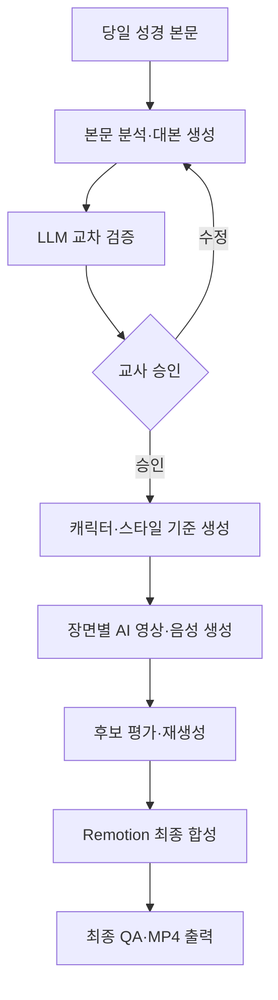
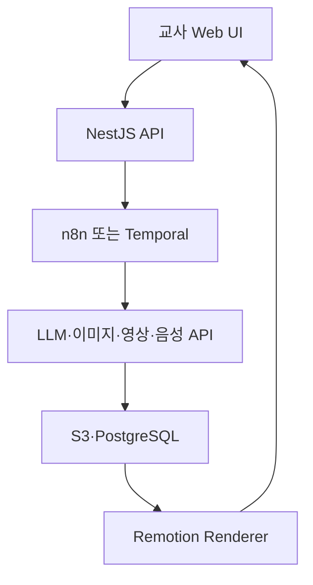

# 성경 말씀 AI 애니메이션 제작 시스템

## 1. 프로젝트 목표

교회 초등부 3~4학년 어린이가 당일 성경 말씀을 쉽고 재미있게 이해하도록, 입력된 성경 본문을 3~5분 분량의 애니메이션 영상으로 제작한다.

이 프로젝트는 Python으로 애니메이션을 직접 구현하는 시스템이 아니다. 생성형 AI의 영상·이미지·음성 API를 조합하고, TypeScript 기반 애플리케이션이 전체 제작 과정과 검수를 자동화한다.

첫 번째 60~90초 결과물을 실제로 만드는 순서는 [PoC 제작 매뉴얼](./POC_MANUAL.md)을 따른다.

| 구분 | 내용 |
| --- | --- |
| 대상 | 교회 초등부 3~4학년 |
| 입력 | 당일 성경 본문, 번역본, 핵심 주제, 선택 정보 |
| 출력 | 성경 내용 중심의 3~5분 애니메이션 MP4 |
| 기본 형식 | 16:9, 1920×1080, 한국어 음성·자막 |
| 영상 방식 | AI가 생성한 짧은 장면 영상을 연결한 2D/3D 스타일 애니메이션 |
| 우선순위 | 성경 정확성 > 캐릭터 일관성 > 영상 품질 > 제작 속도 > 비용 |
| 핵심 원칙 | 본문 충실성, 어린이 눈높이, 교사 승인, 재현 가능한 생성 이력 |

현재 단계에서는 LLM과 생성형 미디어 비용을 주요 제약으로 두지 않는다. 동일 장면을 여러 번 생성하고 복수 모델로 검증해서 가장 좋은 결과를 선택하는 **품질 우선 방식**을 사용한다.

---

## 2. 제작 원칙

### 2.1 성경 본문 우선

- 사건 순서, 인물, 장소, 행동, 핵심 메시지는 입력된 성경 본문을 기준으로 한다.
- 성경에 없는 대사·감정·행동을 실제 사건처럼 추가하지 않는다.
- 직접 인용, 본문 요약, 이해를 돕는 내레이터 설명을 명확하게 구분한다.
- 모든 장면과 대사에 근거가 되는 `source_verses`를 기록한다.
- 영상 마지막에 본문 범위와 번역본을 표시한다.
- 사용하는 번역본, 음원, AI 생성 결과의 이용·배포 조건을 확인한다.

### 2.2 초등부 3~4학년 눈높이

- 한 문장은 짧게 쓰고 어려운 신학 용어는 쉬운 말로 설명한다.
- 한 장면에는 하나의 핵심 사건만 표현한다.
- 폭력, 죽음, 전쟁은 의미를 훼손하지 않는 범위에서 비자극적으로 묘사한다.
- 영상은 3~5분, 장면은 10~18개를 기본값으로 한다.
- 재미 요소는 표정, 움직임, 카메라, 효과음, 질문 형식으로 제공하되 본문을 바꾸지 않는다.

### 2.3 AI 결과는 반드시 검수

- 대본 생성 LLM과 본문 검증 LLM을 분리한다.
- 영상 생성 전에 교사가 대본과 스토리보드를 승인한다.
- 생성 영상에서 인물 왜곡, 비정상 신체, 시대에 맞지 않는 물건, 부적절한 공포 표현을 검사한다.
- 최종 영상은 자막, 발음, 음량, 장면 순서, 본문 왜곡 여부를 다시 확인한다.

---

## 3. 핵심 구현 방향

### 3.1 긴 영상을 한 번에 만들지 않는다

3~5분 영상을 하나의 프롬프트로 생성하지 않는다. AI 영상 모델은 짧은 장면 생성에 더 적합하므로, 장면별로 5~10초 영상을 만든 뒤 최종 타임라인에서 연결한다.



### 3.2 캐릭터와 화풍을 먼저 고정한다

영상 생성 전에 다음 기준 자료를 만든다.

- `style-bible.json`: 전체 색감, 2D/3D 스타일, 조명, 카메라, 금지 표현
- `character-bible.json`: 인물별 나이대, 얼굴, 머리, 의상, 색상, 소품
- 캐릭터별 정면·측면·전신 기준 이미지
- 반복해서 등장하는 장소의 기준 이미지
- 장면별 시작 프레임과 필요한 경우 마지막 프레임

각 영상 생성 요청에 동일한 캐릭터 ID, 기준 이미지, 화풍 설명을 전달한다. 캐릭터 일관성이 깨진 장면은 해당 장면만 재생성한다.

### 3.3 AI가 영상 제작을 담당하고 코드는 연결과 검수를 담당한다

코드가 직접 인물의 움직임을 계산하거나 프레임을 그리지 않는다.

| 담당 | 역할 |
| --- | --- |
| LLM | 본문 분석, 어린이용 대본, 장면 분할, 프롬프트 작성, 교차 검증 |
| 이미지 AI | 캐릭터 시트, 장소 기준 이미지, 장면 시작 프레임 생성 |
| 영상 AI | 기준 이미지를 움직이는 5~10초 장면 영상 생성 |
| 음성 AI | 내레이션, 인물별 대사, 발음과 감정 표현 |
| 효과음 AI | 바람, 군중, 발걸음, 자연 환경 등 장면 효과음 |
| TypeScript 애플리케이션 | 작업 상태, 승인, API 호출, 재시도, 결과 이력 관리 |
| Remotion·FFmpeg | 장면 연결, 자막, 음성, 음악, 효과음, 최종 MP4 렌더링 |

---

## 4. AI 도구 선정

AI 모델 이름과 기능은 변경될 수 있으므로 공급자별 Adapter를 둔다. 아래 도구는 초기 권장 조합이며, 품질 평가 결과에 따라 장면별로 다른 모델을 사용할 수 있다.

### 4.1 권장 조합

| 제작 단계 | 1차 선택 | 대체·보완 | 선정 이유 |
| --- | --- | --- | --- |
| 본문 분석·대본 | 구조화 출력이 가능한 고성능 LLM | 다른 공급자의 LLM | 긴 본문 이해, JSON 스키마 출력, 교차 검증 |
| 캐릭터·장면 이미지 | 참조 이미지 기반 이미지 생성 API | Runway 이미지 생성 또는 다른 이미지 API | 캐릭터 시트와 시작 프레임 생성 |
| 장면 영상 | Gemini Omni Flash | Google Veo 3.1 | 멀티 입력, 캐릭터 일관성, 장면 수정 중심 |
| 영상 대체 공급자 | Runway API Model Router | Runway 개별 영상 모델 | 장면별 최적 모델 선택과 공급자 장애 대응 |
| 음성 | ElevenLabs TTS | 다른 한국어 TTS API | 감정, 화자별 목소리, 한국어 내레이션 |
| 효과음 | ElevenLabs Sound Effects | 라이선스가 확인된 효과음 라이브러리 | 텍스트 설명으로 길이별 효과음 생성 |
| 영상 합성 | Remotion | FFmpeg 직접 명령 | React·TypeScript로 타임라인과 자막 구성 |
| 최종 인코딩·검사 | FFmpeg·ffprobe | 없음 | 표준 MP4 인코딩, 음량·해상도·길이 검사 |

### 4.2 영상 모델 사용 원칙

- 기본 장면은 `이미지 → 영상` 방식으로 생성해 인물과 화풍을 유지한다.
- 대화가 중요한 장면은 음성을 먼저 만든 뒤 립싱크 또는 캐릭터 퍼포먼스 기능을 적용한다.
- 복잡한 장면은 하나의 영상에 여러 행동을 넣지 않고 컷을 나눈다.
- 모델이 만든 영상의 자체 음성은 최종 음성으로 바로 사용하지 않는다. 대본과 일치하는지 검증하고 필요하면 제거한 뒤 승인된 TTS를 합성한다.
- 모델명은 코드에 직접 퍼뜨리지 않고 DB 또는 환경 설정에서 선택한다.

### 4.3 품질 우선 생성 전략

비용보다 결과 품질을 우선하므로 다음 방식을 기본값으로 사용한다.

1. 대본 초안을 두 개의 LLM이 독립적으로 작성한다.
2. 별도 검증 LLM이 본문 근거와 어린이 적합성을 비교한다.
3. 장면별 시작 이미지를 4개 생성하고 가장 일관된 1개를 선택한다.
4. 승인된 시작 이미지로 장면 영상 후보를 2~3개 생성한다.
5. 멀티모달 LLM이 캐릭터, 행동, 시대 배경, 안전성을 평가한다.
6. 기준 점수 미달 장면만 프롬프트를 수정해 재생성한다.
7. 중요한 장면은 교사가 후보를 직접 선택할 수 있게 한다.

자동 점수만으로 최종 영상을 확정하지 않는다. 자동 평가는 재생성 대상을 줄이기 위한 보조 수단이다.

---

## 5. 권장 기술 스택

핵심 런타임은 Python이 아니라 **Node.js LTS + TypeScript**로 통일한다.

| 영역 | 선택 | 용도 |
| --- | --- | --- |
| 웹 UI | Next.js + TypeScript | 본문 입력, 대본·스토리보드 수정, 후보 영상 선택, 승인 |
| 백엔드 API | NestJS | 프로젝트, 장면, 승인, 생성 작업 API |
| 입력·출력 스키마 | Zod | LLM 구조화 결과와 API 요청 검증 |
| DB | PostgreSQL + Prisma | 프로젝트, 장면, 프롬프트, 모델, 승인, 생성 이력 |
| 파일 저장소 | S3 호환 저장소·MinIO | 이미지, 오디오, 장면 영상, 최종 영상 |
| 초기 워크플로 | n8n | API 연결, Webhook, 승인 대기, 빠른 파이프라인 실험 |
| 운영 워크플로 | Temporal TypeScript SDK | 장시간 작업, 재시도, 중단·재개, 승인 Signal, 상태 추적 |
| 영상 타임라인 | Remotion | TypeScript·React 기반 영상 구성과 렌더링 |
| 미디어 처리 | FFmpeg·ffprobe | 믹싱, 자막, 코덱, 음량, 영상 속성 검사 |
| LLM 연동 | Vercel AI SDK 또는 공급자 SDK | 구조화 출력, 멀티모달 평가, 공급자 Adapter |
| API 호출 | 공급자 공식 TypeScript SDK 또는 `fetch` | 영상·이미지·음성 생성 요청 |
| 테스트 | Vitest + Playwright | 스키마·워크플로·승인 화면 테스트 |
| 관측성 | OpenTelemetry | 장면별 처리 시간, 실패, 재시도, 모델 이력 추적 |

Python은 다음 경우에만 선택적으로 허용한다.

- TypeScript에서 사용할 수 없는 특정 연구 모델을 검증할 때
- 일회성 데이터 분석이나 품질 평가 실험을 할 때
- 공급자가 Python SDK만 제공하고 REST API도 제공하지 않을 때

Python 서비스가 필요하더라도 전체 파이프라인을 Python으로 전환하지 않고, 독립된 보조 Worker로 격리한다.

---

## 6. 시스템 아키텍처



### 컴포넌트 책임

| 컴포넌트 | 책임 |
| --- | --- |
| Next.js | 프로젝트 생성, 본문 입력, 대본 수정, 장면 미리보기, 승인 |
| NestJS | 인증, 데이터 관리, 공급자 Adapter, 작업 시작·취소 API |
| n8n | MVP 단계에서 생성 API 연결과 승인 흐름을 시각적으로 검증 |
| Temporal | 운영 단계에서 장시간 영상 생성의 재시도·중단·재개·보상 처리 |
| PostgreSQL | 프로젝트 상태와 모든 생성·검수 이력 저장 |
| S3·MinIO | 큰 미디어 파일과 모델 입출력 보관 |
| Remotion Worker | 승인된 장면을 최종 영상으로 합성 |

### 워크플로 상태

```text
DRAFT
→ SCRIPT_GENERATING
→ SCRIPT_REVIEW
→ ASSET_GENERATING
→ STORYBOARD_REVIEW
→ VIDEO_GENERATING
→ VIDEO_REVIEW
→ RENDERING
→ FINAL_REVIEW
→ COMPLETED
```

검수에서 반려되면 전체를 처음부터 실행하지 않고 해당 대본, 이미지 또는 장면 영상만 새 버전으로 생성한다.

---

## 7. 입력과 핵심 데이터 모델

### 7.1 프로젝트 입력

```yaml
title: 다윗과 골리앗
passage:
  book: 사무엘상
  chapter_start: 17
  verse_start: 32
  chapter_end: 17
  verse_end: 50
translation: 사용 허가를 확인한 번역본
scripture_text: |
  실제 본문 입력
lesson:
  theme: 하나님을 믿는 용기
  key_verse: 사무엘상 17장 45절
audience: 초등부 3~4학년
duration_seconds: 240
aspect_ratio: "16:9"
visual_style: warm_storybook_3d
```

### 7.2 장면 모델

```json
{
  "sceneId": "scene-03",
  "title": "다윗이 골리앗 앞에 서다",
  "sourceVerses": ["사무엘상 17:41-47"],
  "durationSeconds": 8,
  "narration": "다윗은 하나님을 믿고 골리앗 앞에 섰어요.",
  "dialogue": [],
  "characters": ["david", "goliath"],
  "referenceAssetIds": ["character-david-v1", "character-goliath-v1"],
  "visualPrompt": "승인된 캐릭터와 화풍을 사용하는 장면 프롬프트",
  "motionPrompt": "다윗이 침착하게 앞으로 한 걸음 걷고 카메라가 천천히 가까워진다.",
  "negativePrompt": "blood, gore, modern objects, text, extra limbs",
  "generationPolicy": {
    "imageCandidates": 4,
    "videoCandidates": 3,
    "minimumQaScore": 0.9
  },
  "safety": {
    "violenceLevel": "low",
    "notes": "상처와 피를 직접 표현하지 않는다."
  }
}
```

대사 유형은 다음과 같이 관리한다.

- `direct_quote`: 입력 본문의 직접 인용
- `paraphrase`: 어린이 눈높이에 맞춘 본문 요약
- `narrator_explanation`: 이해를 돕는 설명
- `creative`: 본문에 없는 창작 표현. 기본 금지이며 교사 승인이 필요

---

## 8. AI 에이전트와 스킬

각 스킬은 하나의 책임만 수행하고 Zod로 검증 가능한 JSON을 반환한다.

| 스킬 | 역할 | 출력 |
| --- | --- | --- |
| `scripture-parser` | 인물·장소·사건·순서·핵심 구절 추출 | `analysis.json` |
| `child-script-writer` | 초등 3~4학년용 대본 작성 | `script.json` |
| `bible-fact-checker` | 모든 문장을 본문 절과 대조 | 검증 결과·경고 |
| `storyboard-director` | 컷, 시간, 행동, 카메라, 음향 설계 | `storyboard.json` |
| `character-director` | 인물 외형·의상·색상·금지 요소 고정 | 캐릭터 기준 자료 |
| `prompt-engineer` | 이미지·영상 모델별 프롬프트 변환 | 공급자별 요청 |
| `scene-generator` | 이미지와 장면 영상 후보 생성 | 후보 미디어 |
| `visual-continuity-reviewer` | 인물·화풍·시대 배경·동작 오류 검사 | 장면 QA 점수 |
| `voice-director` | 화자, 속도, 감정, 발음 사전 관리 | 음성 파일 |
| `video-composer` | 장면·음성·자막·음악을 타임라인에 합성 | `preview.mp4` |
| `content-safety-reviewer` | 연령 부적절 표현과 공포·폭력 검사 | 안전성 보고서 |
| `final-qa` | 본문·자막·발음·음량·렌더링 검사 | `qa-report.json` |

대본 작성 모델이 자신의 결과를 최종 승인하지 않도록 생성과 검증을 분리한다.

---

## 9. 장면 생성 상세 흐름

1. 본문을 원본 그대로 저장한다.
2. LLM이 인물, 장소, 사건, 순서, 핵심 구절을 구조화한다.
3. 두 개의 대본 후보를 생성한다.
4. 별도 LLM이 문장별 근거 절과 창작 여부를 판정한다.
5. 교사가 대본을 수정·승인한다.
6. 캐릭터와 장소 기준 이미지를 생성해 승인받는다.
7. 장면별 이미지 후보를 생성하고 일관성을 평가한다.
8. 선택된 이미지로 짧은 영상 후보를 생성한다.
9. 영상 이해 모델이 스토리보드와 실제 영상을 비교한다.
10. 기준 미달 장면만 재생성한다.
11. TTS, 효과음, 자막을 만든다.
12. Remotion이 승인된 자산을 합성한다.
13. 교사가 미리보기를 승인한 후 최종 MP4를 렌더링한다.

---

## 10. 품질 검증 기준

### 10.1 본문 정확성

- 등장인물과 사건 순서가 본문과 일치한다.
- 핵심 사건과 구절이 누락되지 않는다.
- 본문에 없는 기적, 대사, 결론이 사실처럼 추가되지 않는다.
- 모든 장면과 문장에 `sourceVerses`가 존재한다.

### 10.2 시각적 일관성

- 같은 인물의 얼굴, 의상, 나이대, 소품이 유지된다.
- 장면마다 전체 화풍과 색감이 유지된다.
- 손가락, 얼굴, 신체, 문자 생성 오류가 없다.
- 현대 물건이나 시대에 맞지 않는 배경이 없다.
- 장면의 실제 행동이 승인된 스토리보드와 일치한다.

### 10.3 어린이 적합성

- 초등 3~4학년이 이해할 수 있는 문장이다.
- 공포와 폭력 표현이 자극적이지 않다.
- 영상과 효과음이 과도하게 빠르거나 크지 않다.
- 재미를 위한 연출이 본문 의미를 바꾸지 않는다.

### 10.4 미디어 품질

- 음성과 자막이 일치한다.
- 성경 인명과 지명의 발음이 정확하다.
- 대사, 효과음, 배경음악의 음량이 균형을 이룬다.
- 최종 파일이 지정 해상도, 프레임률, 코덱으로 재생된다.

---

## 11. 권장 디렉터리 구조

```text
bible_animation/
├── apps/
│   ├── web/                    # Next.js
│   ├── api/                    # NestJS
│   └── renderer/               # Remotion
├── packages/
│   ├── schemas/                # Zod 데이터 모델
│   ├── providers/
│   │   ├── llm/
│   │   ├── image/
│   │   ├── video/
│   │   └── audio/
│   ├── skills/
│   ├── prompts/
│   └── shared/
├── workflows/
│   ├── n8n/
│   └── temporal/
├── assets/
│   ├── music/
│   ├── effects/
│   ├── fonts/
│   └── style-bibles/
├── examples/
├── tests/
├── docs/
│   └── README.md
├── package.json
├── pnpm-workspace.yaml
└── README.md
```

생성된 미디어는 Git에 넣지 않는다. S3 호환 저장소에 보관하고 Git에는 코드, 프롬프트 템플릿, 스키마, 워크플로 정의만 저장한다.

---

## 12. 구현 단계

### 1단계: AI 영상 품질 검증 PoC

백엔드 전체를 먼저 만들지 않고, 성경 본문 하나를 선정해 도구 조합의 품질을 검증한다.

- 대본과 6개 핵심 장면 작성
- 캐릭터 기준 이미지 생성
- 동일 장면을 Gemini 계열과 Runway 계열로 각각 생성
- 캐릭터 일관성, 동작 정확성, 한국어 음성 품질 비교
- 교사가 결과를 보고 기본 화풍과 공급자 조합 확정

완료 기준: 한 개 본문으로 60~90초짜리 검수 영상이 생성된다.

### 2단계: TypeScript 자동화 MVP

- NestJS 프로젝트·장면 API
- Zod 스키마
- n8n 워크플로
- LLM, 영상, 음성 Provider Adapter
- 생성 요청 폴링과 Webhook 처리
- Remotion 미리보기 렌더링

완료 기준: API 한 번으로 대본부터 미리보기 영상까지 생성된다.

### 3단계: 교사 검수 UI

- 당일 본문 등록
- 대본과 스토리보드 수정·승인
- 캐릭터와 장면 후보 비교
- 장면별 재생성
- 미리보기 승인과 최종 다운로드

완료 기준: 비개발자 교사가 전체 제작 흐름을 수행한다.

### 4단계: 운영 안정화

- 장시간 워크플로를 Temporal TypeScript로 이전
- 실패 재시도, 중단·재개, 장면별 재실행
- 생성 모델·프롬프트·Seed·입출력 이력 저장
- 품질 점수와 교사 선택 결과 축적
- 렌더링 Worker 수평 확장

완료 기준: 일부 공급자 장애나 장면 실패가 있어도 전체 프로젝트를 다시 시작하지 않는다.

---

## 13. 첫 번째 구현 목표

첫 구현은 Python CLI가 아니라 TypeScript 기반 명령과 n8n Webhook으로 시작한다.

```bash
pnpm bible:create --input examples/1-samuel-17.yaml
```

또는:

```http
POST /api/projects
Content-Type: application/json

{
  "inputFile": "examples/1-samuel-17.yaml"
}
```

첫 번째 결과물:

1. 본문 분석 JSON
2. 어린이용 대본과 본문 대조 보고서
3. 승인 가능한 캐릭터 기준 이미지
4. 6개 장면 영상 후보
5. ElevenLabs 음성·효과음
6. Remotion으로 합성한 60~90초 미리보기

이 PoC로 실제 영상 품질과 캐릭터 일관성을 먼저 확인한 후 3~5분 전체 영상과 웹 관리 기능을 확장한다.

---

## 14. 제외 또는 후순위

- 교사 승인 없는 완전 자동 게시
- 3~5분 영상을 한 번의 생성 요청으로 만드는 방식
- 실시간 3D 게임 엔진 기반 애니메이션
- 성경 본문에 없는 자유로운 외전형 스토리
- 여러 번역본을 출처 구분 없이 혼합
- 공급자 하나에만 종속된 데이터 모델
- 생성 파일을 Git 저장소에 직접 보관

---

## 15. 공식 참고 자료

- [Google Gemini API 영상 생성](https://ai.google.dev/gemini-api/docs/video)
- [Google Veo 3.1](https://ai.google.dev/gemini-api/docs/veo)
- [Runway API 문서](https://docs.dev.runwayml.com/)
- [Runway API 모델 목록](https://docs.dev.runwayml.com/guides/models/)
- [ElevenLabs Text to Speech](https://elevenlabs.io/docs/overview/capabilities/text-to-speech)
- [ElevenLabs Sound Effects](https://elevenlabs.io/docs/overview/capabilities/sound-effects)
- [Remotion 서버 렌더링](https://www.remotion.dev/docs/ssr)
- [Temporal TypeScript SDK](https://docs.temporal.io/develop/typescript)
- [n8n Webhook](https://docs.n8n.io/integrations/builtin/core-nodes/n8n-nodes-base.webhook/)
