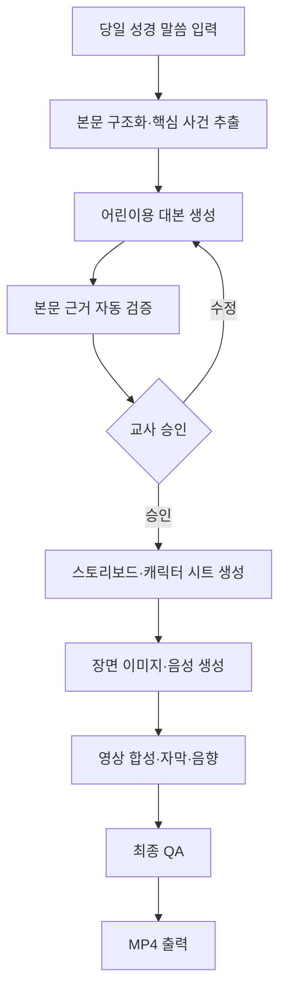

# 성경 말씀 애니메이션 제작 시스템

## 1. 프로젝트 개요

교회 초등부 3~4학년 어린이가 당일 성경 말씀을 쉽고 재미있게 이해할 수 있도록, 성경 본문을 짧은 애니메이션 영상으로 제작하는 시스템이다.

핵심 목표는 화려한 영상 제작 자체가 아니라 **성경 내용을 정확하게 전달하는 것**이다. AI가 성경에 없는 사건이나 교리를 임의로 추가하지 않도록 본문 분석, 대본 검증, 교사 승인 단계를 포함한다.

| 구분 | 내용 |
| --- | --- |
| 대상 | 교회 초등부 3~4학년 |
| 입력 | 당일 성경 본문, 성경 번역본, 선택 정보(설교 주제·핵심 구절·영상 길이) |
| 출력 | 성경 내용 중심의 3~5분 애니메이션 MP4 |
| 기본 형식 | 16:9, 1920×1080, 24/30fps, 한국어 내레이션·자막 |
| 표현 방식 | 2D 스토리북 애니메이션 + 장면 전환 + 카메라 이동 + 효과음 |
| 핵심 원칙 | 본문 충실성, 어린이 눈높이, 인물 일관성, 안전한 표현, 교사 검수 |

---

## 2. 제작 원칙

### 2.1 성경 본문 우선

- 대본의 사건 순서, 인물, 장소, 행동은 입력된 성경 본문을 기준으로 작성한다.
- 성경에 없는 대사나 감정은 사실처럼 단정하지 않는다.
- 이해를 돕기 위한 설명은 본문 대사와 구분하여 내레이터가 전달한다.
- 영상 마지막에 사용한 성경 번역본과 본문 범위를 표시한다.
- 사용하는 번역본의 인용 및 영상 배포 권한을 사전에 확인한다.

### 2.2 초등부 3~4학년 눈높이

- 한 문장은 짧게 작성하고 어려운 신학 용어는 쉬운 말로 설명한다.
- 한 장면에는 하나의 핵심 사건만 배치한다.
- 폭력, 죽음, 전쟁 장면은 사건의 의미를 훼손하지 않는 범위에서 비자극적으로 표현한다.
- 영상은 3~5분, 장면은 8~12개를 기본값으로 한다.
- 재미 요소는 표정, 움직임, 배경음악, 질문 형식으로 제공하되 본문을 바꾸지 않는다.

### 2.3 검수 필수

AI 생성 결과를 바로 최종 영상으로 배포하지 않는다.

- 자동 검증: 인물·사건·순서·핵심 구절이 입력 본문과 일치하는지 검사
- 교사 검수: 대본과 스토리보드를 영상 생성 전에 승인
- 최종 검수: 자막, 발음, 화면, 음량, 성경 내용 왜곡 여부 확인

---

## 3. 사용자 입력

최소 입력은 성경 본문이다. 처음에는 Markdown 또는 JSON 파일 입력으로 구현하고, 이후 웹 입력 화면을 추가한다.

```yaml
title: 다윗과 골리앗
passage:
  book: 사무엘상
  chapter_start: 17
  verse_start: 32
  chapter_end: 17
  verse_end: 50
translation: 사용 허가를 확인한 번역본
scripture_text: |
  실제 본문 입력
lesson:
  theme: 하나님을 믿는 용기
  key_verse: 사무엘상 17장 45절
audience: 초등부 3~4학년
duration_seconds: 240
aspect_ratio: "16:9"
```

필수 입력 검증:

- 성경 책·장·절 범위와 본문 누락 여부
- 번역본 이름과 사용 권한
- 본문에 없는 핵심 메시지가 추가되지 않았는지
- 목표 영상 길이와 대상 연령

---

## 4. 최종 산출물

한 번의 제작 작업은 다음 파일을 생성한다.

```text
outputs/{project_id}/
├── source.json
├── analysis.json
├── script.md
├── storyboard.json
├── prompts/
│   └── scenes.json
├── images/
│   ├── characters/
│   └── scenes/
├── audio/
│   ├── narration/
│   ├── dialogue/
│   └── bgm/
├── subtitles/
│   └── final.srt
├── preview.mp4
├── final.mp4
└── qa-report.json
```

- `script.md`: 내레이션, 대사, 본문 근거가 표시된 대본
- `storyboard.json`: 장면별 등장인물, 배경, 동작, 길이
- `preview.mp4`: 교사 검수용 저해상도 영상
- `final.mp4`: 최종 상영용 영상
- `qa-report.json`: 본문 일치 여부와 미확인 항목

---

## 5. 전체 제작 흐름



### 단계별 처리

1. **본문 수집**
   - 당일 말씀과 번역본 정보를 입력한다.
   - 원문은 수정하지 않고 별도 원본으로 보관한다.

2. **본문 분석**
   - 인물, 장소, 사건, 사건 순서, 핵심 구절을 구조화한다.
   - 각 사실에 근거가 되는 절 번호를 연결한다.

3. **대본 생성**
   - 장면별 내레이션과 대사를 작성한다.
   - 모든 장면에 `source_verses`를 기록한다.
   - 직접 인용, 본문 요약, 교육적 설명을 구분한다.

4. **대본 검증**
   - 입력 본문에 없는 인물·행동·결론을 탐지한다.
   - 근거 절이 없는 문장은 경고로 처리한다.
   - 오류가 있으면 이미지 생성 단계로 넘어가지 않는다.

5. **스토리보드 생성**
   - 장면 구도, 등장인물, 표정, 동작, 배경, 카메라 움직임을 정의한다.
   - 동일 인물은 캐릭터 시트의 고정된 외형 정보를 사용한다.

6. **이미지·음성 생성**
   - 장면 이미지를 생성하고 품질 및 인물 일관성을 검사한다.
   - 내레이션과 대사를 음성으로 생성한다.
   - 어린이에게 불편할 수 있는 장면은 안전 표현 규칙을 적용한다.

7. **영상 합성**
   - 정지 이미지에 줌, 패닝, 레이어 이동을 적용한다.
   - 음성 길이에 맞춰 장면 시간을 조정한다.
   - 자막, 배경음악, 효과음을 합성한다.

8. **최종 검수 및 출력**
   - 본문 일치, 자막 오탈자, 음성 발음, 음량, 해상도를 검사한다.
   - 교사 승인 후 최종 MP4를 생성한다.

---

## 6. 권장 구현 방식

### 6.1 1차 MVP: 2D 스토리북 애니메이션

처음부터 복잡한 3D 또는 완전한 프레임 애니메이션을 만들기보다, AI로 생성한 장면 이미지에 카메라 이동과 레이어 움직임을 적용하는 방식으로 시작한다.

장점:

- 제작 시간과 비용을 예측하기 쉽다.
- 성경 내용 검수 후 필요한 장면만 다시 생성할 수 있다.
- 인물 일관성을 관리하기 쉽다.
- 이미지, 음성, 영상 공급자를 교체하기 쉽다.

### 6.2 권장 아키텍처

| 영역 | 선택 | 용도 |
| --- | --- | --- |
| 언어 | Python 3.12+ | AI 파이프라인, 미디어 처리, 자동화 |
| API | FastAPI | 프로젝트 생성, 상태 조회, 승인 API |
| 데이터 모델 | Pydantic | 입력·대본·스토리보드 스키마 검증 |
| CLI | Typer | MVP 실행 및 로컬 테스트 |
| 작업 큐 | Celery + Redis | 이미지·음성·영상 생성 비동기 처리 |
| DB | PostgreSQL | 프로젝트, 장면, 승인, 생성 이력 저장 |
| 파일 저장소 | 로컬 파일 → S3 호환 저장소 | 이미지, 음성, 최종 영상 저장 |
| LLM 연동 | 공급자 SDK + Adapter | 본문 분석, 대본, 검증 |
| 이미지 생성 | 공급자 API + Adapter | 캐릭터 시트와 장면 이미지 |
| 음성 생성 | TTS 공급자 API + Adapter | 내레이션과 등장인물 음성 |
| 영상 합성 | FFmpeg | 자막, 음향, 인코딩, 최종 렌더링 |
| 장면 연출 | MoviePy 또는 Remotion | 줌, 패닝, 전환, 타임라인 구성 |
| 이미지 처리 | Pillow | 리사이즈, 크롭, 레이어 및 포맷 처리 |
| 음원 처리 | pydub | 음량, 무음, 오디오 구간 편집 |
| 재시도 | Tenacity | 외부 생성 API 실패 재시도 |
| 테스트 | pytest | 스키마, 파이프라인, 검증 규칙 테스트 |

영상 렌더링의 최종 기준 도구는 FFmpeg로 통일한다. MoviePy나 Remotion은 장면 타임라인을 편리하게 구성하기 위한 선택 계층으로 사용한다.

### 6.3 공급자 종속 방지

LLM, 이미지 생성, TTS는 특정 업체를 코드 전체에서 직접 호출하지 않고 공통 인터페이스로 감싼다.

```python
from typing import Protocol

class ScriptGenerator(Protocol):
    def generate(self, scripture: str, audience: str) -> dict: ...

class ImageGenerator(Protocol):
    def generate_scene(self, prompt: str, reference_ids: list[str]) -> str: ...

class VoiceGenerator(Protocol):
    def synthesize(self, text: str, voice_id: str) -> str: ...
```

이 구조를 사용하면 품질, 비용, 라이선스에 따라 공급자를 교체할 수 있다.

---

## 7. AI 에이전트 스킬 구성

각 스킬은 하나의 책임만 수행하고 JSON 스키마로 결과를 전달한다.

| 스킬 | 역할 | 주요 출력 |
| --- | --- | --- |
| `scripture-parser` | 본문에서 인물·장소·사건·순서·핵심 구절 추출 | `analysis.json` |
| `bible-fact-checker` | 생성 문장과 근거 절을 대조하고 추가·왜곡 탐지 | 검증 결과와 경고 |
| `child-script-writer` | 초등 3~4학년 수준의 내레이션·대사 작성 | `script.md` |
| `storyboard-director` | 장면 구도, 행동, 시간, 카메라 연출 설계 | `storyboard.json` |
| `character-designer` | 인물별 외형·의상·색상·금지 요소 고정 | 캐릭터 시트 |
| `scene-image-generator` | 캐릭터 시트를 참조해 장면 이미지 생성 | 장면 이미지 |
| `voice-director` | 화자별 음성, 속도, 감정, 쉼표 정의 | 음성 파일 |
| `video-composer` | 이미지·음성·자막·음악을 타임라인에 합성 | `preview.mp4` |
| `content-safety-reviewer` | 연령 부적절 표현, 공포·폭력 묘사 검사 | 안전성 보고서 |
| `final-qa` | 본문, 자막, 발음, 음량, 렌더링 결과 검사 | `qa-report.json` |

중요한 원칙:

- 대본 작성 스킬과 본문 검증 스킬을 분리한다.
- 검증 스킬에는 생성 대본뿐 아니라 원본 성경 본문을 함께 제공한다.
- 검증 실패를 단순 안내가 아닌 파이프라인 중단 조건으로 사용한다.
- 이미지 생성 프롬프트에도 장면의 근거 절과 캐릭터 ID를 기록한다.

---

## 8. 핵심 데이터 모델

```json
{
  "scene_id": "scene-03",
  "title": "다윗이 골리앗 앞에 서다",
  "source_verses": ["사무엘상 17:41-47"],
  "duration_seconds": 22,
  "narration": "다윗은 하나님을 믿고 골리앗 앞에 섰어요.",
  "dialogue": [
    {
      "speaker": "다윗",
      "text": "대사 또는 본문에 충실한 쉬운 표현",
      "type": "paraphrase"
    }
  ],
  "characters": ["david", "goliath"],
  "background": "이스라엘과 블레셋 군대 사이의 골짜기",
  "action": "다윗이 물맷돌을 들고 골리앗을 바라본다.",
  "camera": {
    "shot": "medium",
    "movement": "slow_zoom_in"
  },
  "safety": {
    "violence_level": "low",
    "notes": "상처와 피를 직접 표현하지 않는다."
  }
}
```

대사 유형:

- `direct_quote`: 입력 성경 본문의 직접 인용
- `paraphrase`: 어린이 눈높이에 맞춘 본문 요약
- `narrator_explanation`: 이해를 돕는 설명
- `creative`: 본문에 없는 창작 표현. 기본적으로 금지하며 예외 시 교사 승인 필요

---

## 9. 품질 검증 기준

### 9.1 내용 정확성

- 등장인물이 본문과 일치한다.
- 사건 순서가 본문과 일치한다.
- 핵심 사건과 핵심 구절이 누락되지 않는다.
- 본문에 없는 기적, 대사, 교훈이 사실처럼 추가되지 않는다.
- 장면별 `source_verses`가 존재한다.

### 9.2 시청 적합성

- 초등 3~4학년이 이해할 수 있는 문장이다.
- 자막이 음성과 일치한다.
- 자막 한 화면의 글자 수가 과도하지 않다.
- 공포·폭력 표현이 자극적이지 않다.
- 배경음악이 대사와 내레이션을 방해하지 않는다.

### 9.3 미디어 품질

- 동일 인물의 얼굴, 의상, 나이대가 장면마다 유지된다.
- 이미지에 잘못 생성된 문자나 신체 표현이 없다.
- 음성이 끊기거나 겹치지 않는다.
- 전체 음량이 일정하고 피크가 발생하지 않는다.
- 최종 영상이 지정 해상도와 코덱으로 재생된다.

---

## 10. 권장 디렉터리 구조

```text
bible_animation/
├── docs/
│   └── README.md
├── app/
│   ├── api/
│   ├── core/
│   ├── models/
│   ├── providers/
│   │   ├── llm/
│   │   ├── image/
│   │   └── voice/
│   ├── skills/
│   ├── pipeline/
│   ├── validators/
│   └── renderer/
├── prompts/
│   ├── scripture_analysis.md
│   ├── child_script.md
│   ├── fact_check.md
│   └── storyboard.md
├── assets/
│   ├── music/
│   ├── effects/
│   └── fonts/
├── templates/
│   └── project.yaml
├── tests/
│   ├── unit/
│   ├── integration/
│   └── fixtures/
├── outputs/
├── pyproject.toml
├── .env.example
└── README.md
```

생성 결과가 Git에 대량 커밋되지 않도록 `outputs/`는 `.gitignore`에 포함한다. 검수 완료 영상은 파일 저장소에 보관하고 DB에는 경로와 생성 이력을 저장한다.

---

## 11. 개발 단계

### 1단계: 대본 생성 및 검증

- YAML/JSON 본문 입력
- 본문 구조화
- 어린이용 대본 생성
- 장면별 근거 절 연결
- 자동 검증 보고서 생성
- 교사 승인용 Markdown 출력

완료 기준: 입력 본문에서 검증 가능한 대본과 스토리보드가 생성된다.

### 2단계: 이미지·음성 생성

- 캐릭터 시트 생성
- 장면 프롬프트 생성
- 장면 이미지 생성 및 재생성
- 내레이션·대사 TTS 생성
- SRT 자막 생성

완료 기준: 모든 장면에 승인된 이미지, 음성, 자막이 존재한다.

### 3단계: 영상 자동 합성

- FFmpeg 기반 타임라인 생성
- 줌, 패닝, 장면 전환
- 음성·배경음악·효과음 믹싱
- 미리보기와 최종 영상 렌더링
- 미디어 품질 자동 검사

완료 기준: 3~5분 길이의 1080p MP4가 자동 생성된다.

### 4단계: 웹 관리 화면

- 오늘의 본문 등록
- 대본·스토리보드 수정 및 승인
- 장면별 재생성
- 작업 진행률과 실패 원인 표시
- 미리보기 및 최종 다운로드
- 프로젝트와 생성 비용 이력 관리

완료 기준: 비개발자 교사도 입력, 검수, 재생성, 다운로드를 수행할 수 있다.

---

## 12. MVP 범위에서 제외할 항목

초기 버전의 복잡도를 낮추기 위해 다음 기능은 후순위로 둔다.

- 실시간 3D 캐릭터 애니메이션
- 완전 자동 립싱크
- 장편 영상
- 교사 승인 없는 완전 자동 게시
- 여러 번역본의 자동 혼합
- 성경 본문에 없는 자유로운 외전형 스토리
- YouTube 등 외부 플랫폼 자동 업로드

---

## 13. 첫 번째 구현 목표

첫 번째 기능은 다음 명령 하나로 검수용 결과를 만드는 것이다.

```bash
python -m app.cli create \
  --input examples/1-samuel-17.yaml \
  --output outputs/david-and-goliath
```

예상 실행 결과:

1. 성경 본문 구조 분석
2. 어린이용 대본 생성
3. 본문 일치 여부 검증
4. 스토리보드 생성
5. `script.md`, `storyboard.json`, `qa-report.json` 출력

이 단계에서 대본과 스토리보드의 정확성을 충분히 검증한 다음 이미지, 음성, 영상 생성 기능을 연결한다.
